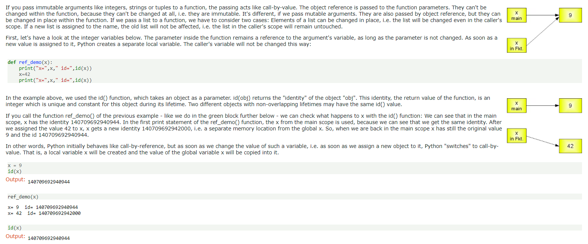

# Thins to remember/review:

- What make a good hashTable?

  - 好的哈希函数有两个特点：简单，均匀性。所谓<u>简单就是可以很快地产生一个较好的 hash 值</u>，<u>均匀性是指所有的数据可以均匀地映射到各个 hash 值上，避免产生大部分数据映射到少数的 hash 值上</u>。开散列法表头数组变大，冲突可能性会降低，因为可以映射到的组变多了。开散列法的哈希表删除元素与插入操作类似。

- 如何实现一个可变长数组？请你设计一个class，支持末尾插入，末尾删除，访问第i个元素，问实现方法要求能支持Indexing and随机访问.
  - 分配多长的连续空间？
    - 空数组，分配常数空间
  - Push back空间不够用怎么处理？
    - 申请2倍大小连续空间 >> 拷贝 >> 销毁原对象 >> 释放旧空间
  - Pop back空间剩余很多如何收回？
    - 如果空间利用率不到25%（也就是75%都没用到），释放一半的空间
  
- Two pointer array 题的模板:

  ```python
  class Solution:
      def removeDuplicates(self, nums: List[int]) -> int:
          """
              Input: nums = [0,0,1,1,1,2,2,3,3,4]
              Output: 5, nums = [0,1,2,3,4,_,_,_,_,_]
              Explanation: Your function should return k = 5, with the first five elements of nums being 0, 1, 2, 3, and 4 respectively. It does not matter what you leave beyond the returned k (hence they are underscores).
          """
          # 思考1: 什么时候要这个数？==》1)当它和前面的数不一样的时候，2)当它是第一个数时
          # 思考2：如果时in-place, 这array可不可以覆盖，什么时候可以？==》这个题可以覆盖，因为n的位置是永远less than or equal to i 的
          n = 0   # 跟踪最后一个valid的数。 
          for i in range(len(nums)):
              if i==0 or nums[i] != nums[i-1]: # 第一个肯定要。（不同的题，条件会不一样
                  nums[n] = nums[i]
                  n += 1
          return n
  ```
  
- 88.Merge Sorted Array:

  ```python
  class Solution:
      def merge(self, nums1: List[int], m: int, nums2: List[int], n: int) -> None:
          p1, p2 = m-1, n-1
          i=m+n-1
          while p1>=0 or p2>=0: # Traver from tail to the head
              if p2<0 or (p1>=0 and nums1[p1]>nums2[p2]):
                  nums1[i] = nums1[p1]
                  p1-=1
              else:
                  nums1[i] = nums2[p2]
                  p2-=1
              i-=1
  ```
  
  https://leetcode-cn.com/problems/merge-sorted-array/
  
- How to traverse over a linked list?

  ```python
  # 遍历链表：
  while head:
      head = head.next # 如果需要更改，新建一个指针暂存
  ```

- When you need to create/add a protectNode?

  - When you need to return the head

  ```python
  ListNode protect = new ListNode(0, head); # return protect.next
  ```

- What mechanism Python is using for function passing? and what is pass by sharing?

  - What is pass by sharing in Python:  ==> 简单来说就是下图。它和 ”copy-by-value” and “copy by reference” 都不一样。C是”copy-by-value”，当pointer被pass to caller, an exact copy will be created. However, in python, it’s using “copy by sharing”, so a new address/reference will be created.  More details refers to this, https://www.python-course.eu/python3_passing_arguments.php
  - 

